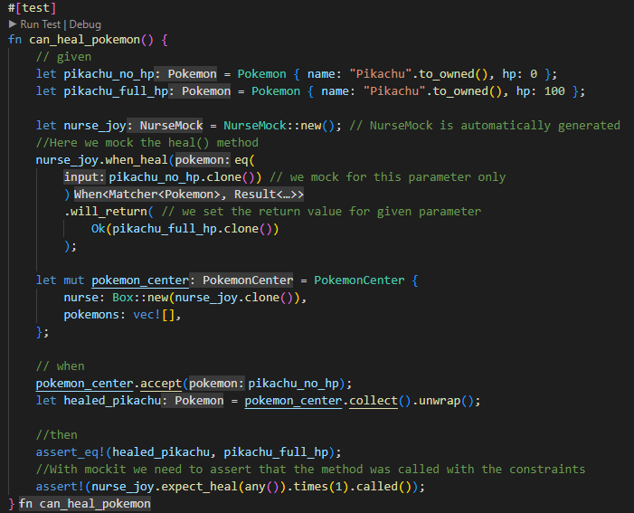
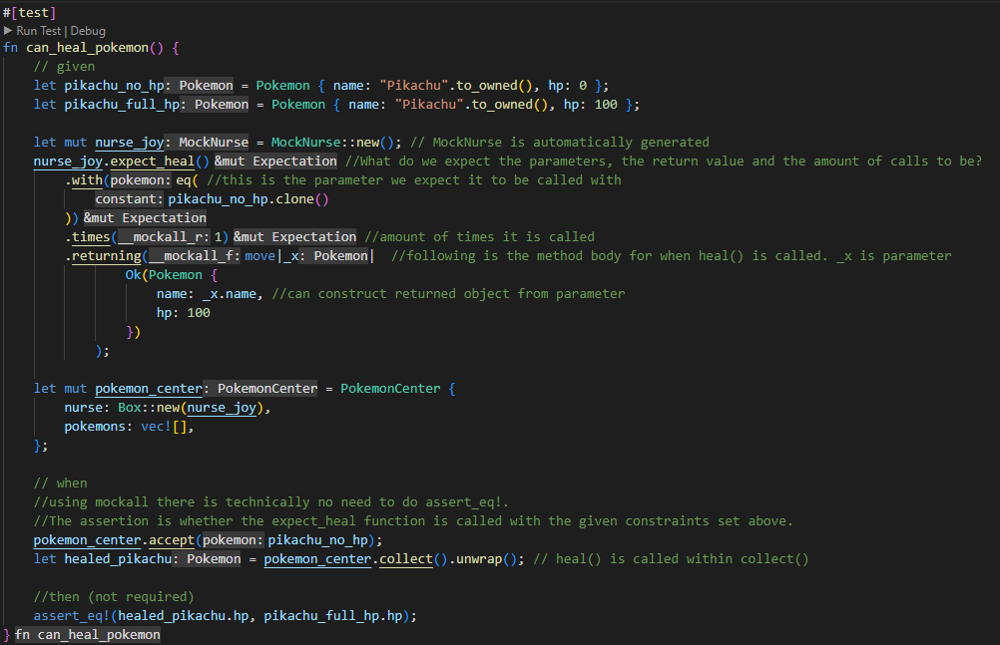
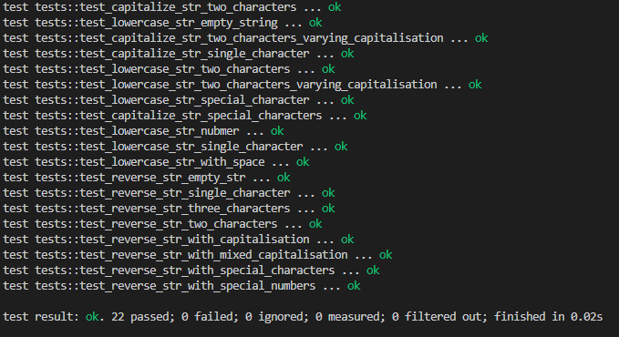
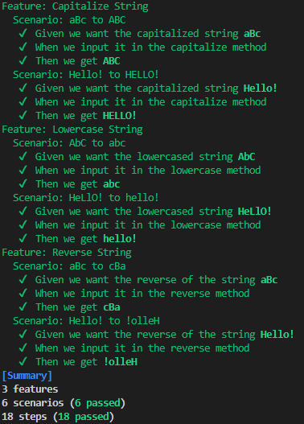
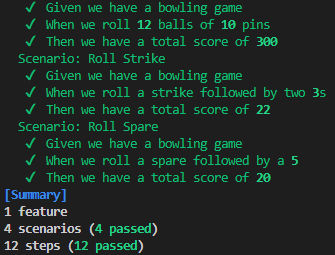

# Readme
Repository for Test Assignment 2. Solutions to Katas found in /stringutility and /bowlinggame. Examples of the two mocking libraries are found in /mocking. 
Gherkin .feature files are found in /feature folder inside either project. Tests can be found in /tests folder of either project. 

To run unit tests, navigate to folder of either of the projects and run:
```
cargo test --test unittests
```
and to run acceptance tests, run:
```
cargo test --test acceptancetests
```

Images of test results can be found at the bottom of this readme.

# Assignment 2

## 1. Reflections
### 1. Computer Mouse
*Identify the types of testing you would perform on a computer mouse, to make sure that it is of the highest quality.*
Accuracy test for sensor
Test connection through wire
Test that each button is working
Stress test each button to see how long it takes for them to break
Damage test

### 2. Catastrophic Failure
*Find a story where a software system defect had a bad outcome. Describe what happened. Can you identify a test that would have prevented it?*
In 2005 a new raid was released in World of Warcraft, in which one of the bosses gave a plague effect to the players, that would spread between them. The bug occurred when some players with pet companions deactivated them while they were affected by the plague. By deactivating them, the plague was able to be carried out of the raid and into the open world, which started a pandemic that resulted in dead bodies being spread across the major cities.

This is a bug occurring in the integration between different parts of the system (that being the plague effect and the player companions). To have caught it a test making sure that the plague effect was cleared when leaving the raid would have not just been needed for players, but also for their companions. It is such a niché interaction that in order to have caught it, a tester would have had to have foreseen it.

## 3. Investigation of Tools
### 1. JUnit5
*Investigate JUnit 5 (Jupiter). Explain the following and how they are useful.*
#### @Tag
  - Used to allow filtering of which tests are executed based on tags. So for example only running database related tests.
#### @Disabled
  - Temporarily disables a test without having to delete it.
#### @RepeatedTest
  - Repeats a test the given amount of times. By using together with @ParameterizedTest it is possible to run the test with different arugments each time.
#### @BeforeEach, @AfterEach
  - Runs the given method before or after each test. Allows for setup and cleanup before and after each test.
#### @BeforeAll, @AfterAll
  - Runs the given method before or after all tests. Allows for setup and cleanup before and after all tests.
#### @DisplayName
  - Allows for declaring a custom name for a test, different from the method name. Allows for more specific test names than otherwise.
#### @Nested
   -  Allows for splitting tests into multiple different classes within a file, for better categorization. Great for when testing a large class with multiple hundreds of lines.
#### assumeFalse, assumeTrue
  - failed assumptions do not result in test failure, but just aborts the test. Useful whenever it does not make sense to continue execution of a given test method, if for example the test depends on something that ends up not existing. 
### 2. Mocking Frameworks
*Investigate mocking frameworks for your preferred language. Choose at least two frameworks, and answer the questions.*

I am trying out the Rust libraries Mock-it and Mockall.
#### 1. What are their similarities?
Both libraries automatically generate the mocked versions of traits, which is Rust's (almost) equivalent to interfaces. Both set up expectations using method chaining, and allow for expecting specific parameters, return values and amount of times the method is called.
#### 2. What are their differences?
Mock-it requires explicit asserts, whereas with Mockall the assertions are implicit. This means that Mockall requires you to assert your then *before* you call your function. 
Additionally Mockall not only allows for expecting a specific return value, but allows for the return value to be contstructed in a closure (anonymous function), which gives more dynamic control over the expected return value.

##### Mock-it Example code

##### Mockall Example code


#### 3. Which one would you prefer, if any, and why?
Mock-it is nice because it requires the tester to be more explicit in what they expect. It reads more cleanly to someone not familiar with the library, since the setup of what the Mocked method is supposed to return is separate from the assertions, allowing the test to be split into clear "given", "when", "then" sections. With Mockall "when" and "then" blur together, which is not great. I also really like Mock-it's motto: "Mock it, don't mock all 🙃"

However, it does result in more boilerplate code. Additionally Mockall is a more powerful library, meaning it has less constraints and more community support (both are open-source). In contrast to Mockall, Mock-it doesn't support mocking structs, only traits. I also really like being able to define a closure for the mocked method, because it allows me to construct the returned object based on the values on the one passed to it. So despite above mentioned points, I will be using Mockall in the future. 

# Test Results
## Unit Test Results
### Stringutility

### Bowling Game

## Acceptance Tests
### Stringutility

### Bowling Game
